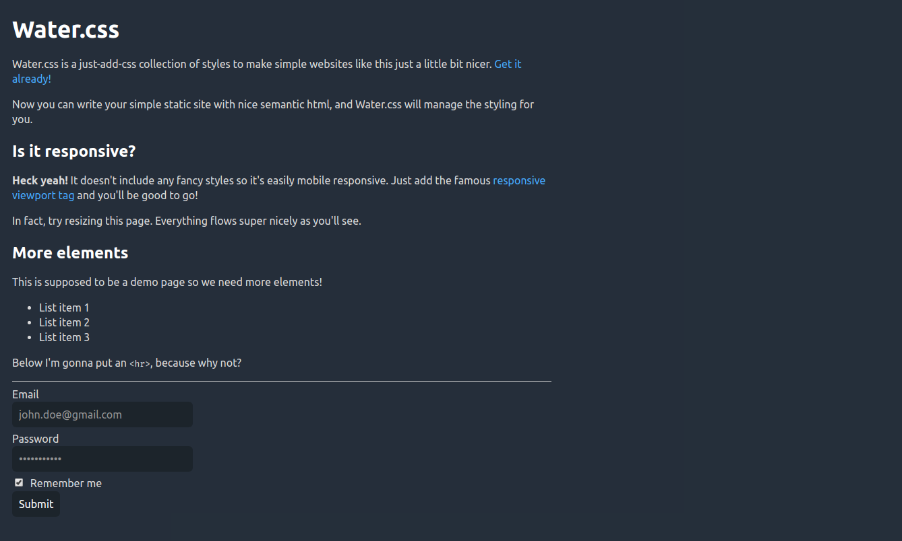

# Water.css

[](https://kognise.github.io/water.css/)

*A just-add-css collection of styles to make simple websites just a little nicer*

[](https://www.reddit.com/r/programming/comments/b9ixev/watercss_a_collection_of_styles_for_simple_static/) [](https://github.com/kognise/water.css/blob/master/LICENSE.md)

## Why?

I commonly make quick demo pages or websites with simple content. For these, I don't want to spend time styling them but don't like the uglyness of the default styles.

Water.css is a css framework that doesn't require any classes. You just include it in your `<head>` and forget about it, while it silently makes everything nicer.

## Who?

You might want to use Water.css if you're making a simple static or demo website that you don't want to spend time styling.

You probably don't want to use it for a production app or something that has more than a simple document. Rule of thumb: if your site has a navbar, don't use Water.css. It's just not meant for that kind of content.

## How?

Just stick this in your head:

```html
<link rel='stylesheet' href='https://cdn.jsdelivr.net/gh/kognise/water.css@latest/water.min.css'>
```

No other classes or code is required to make Water.css work.

Well, I may have lied a *little* bit when I said Water.css makes use of no classes: if you're a light theme guy (shame on you!) just add the class `.light` to your `<body>` and everything will burn your eyes. 

Oh, you want a demo you say? Cheeky fellah!

[Well, here's your demo.](https://kognise.github.io/water.css/) And here's a screenshot to top it off:



Don't forget there's a light theme as well.

Don't like how it looks? Feel free to submit an issue or PR with suggestions.

## Contributing

Water.css can be greatly improved if people in the community help make it better!

Have any questions or concerns? Did I forget an element or selector? Does something look ugly? Feel free to submit an issue.

If people are interested I'll make a Jekyll theme with Water.css and possibly an NPM package, I'd love any help with that.
